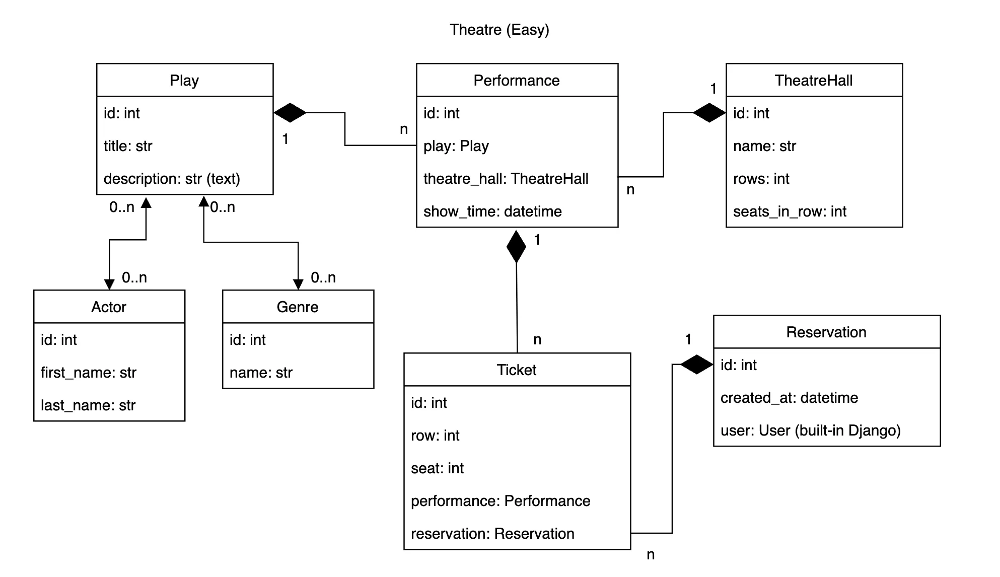
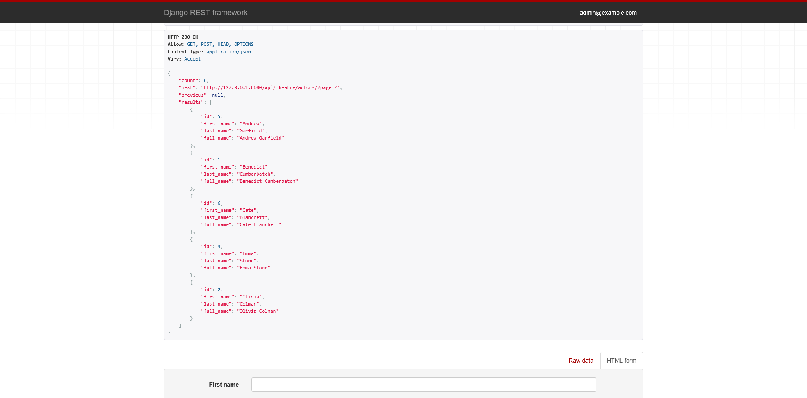
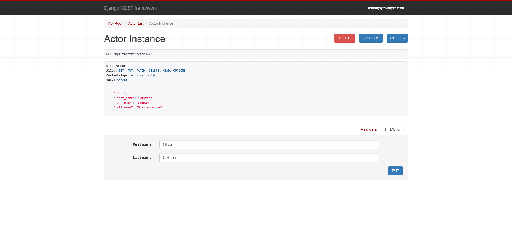
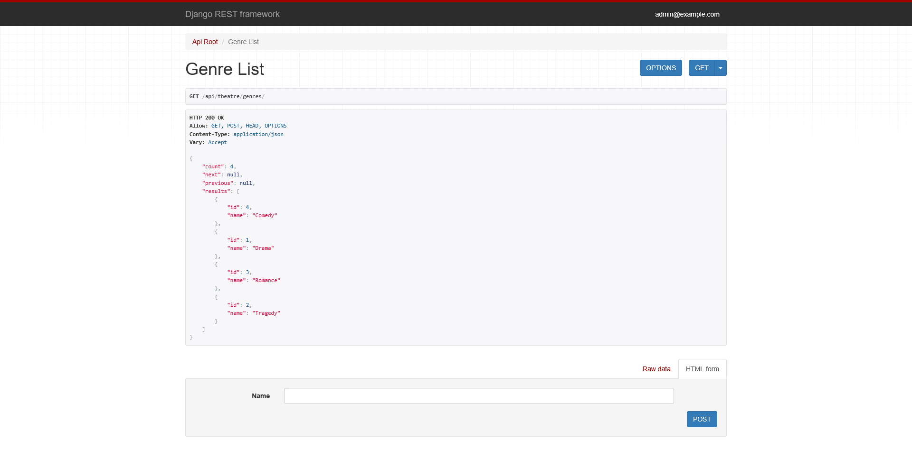
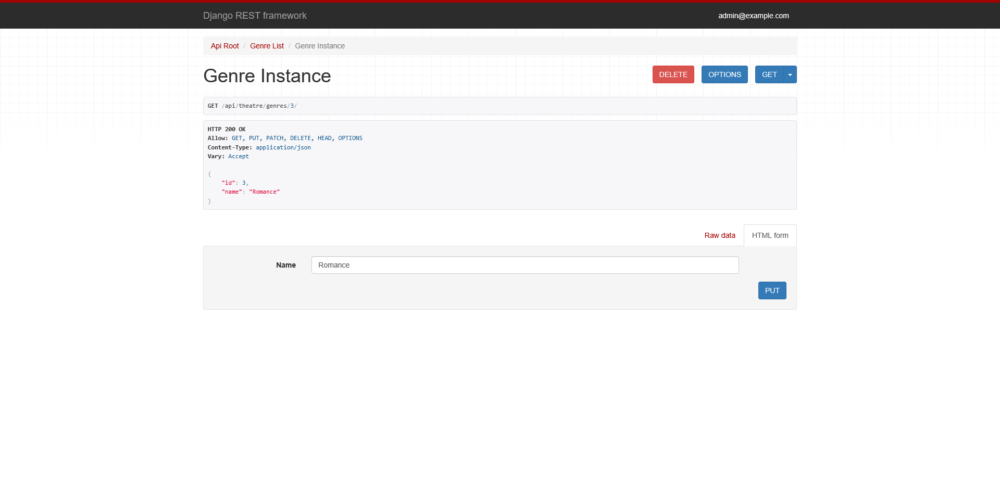
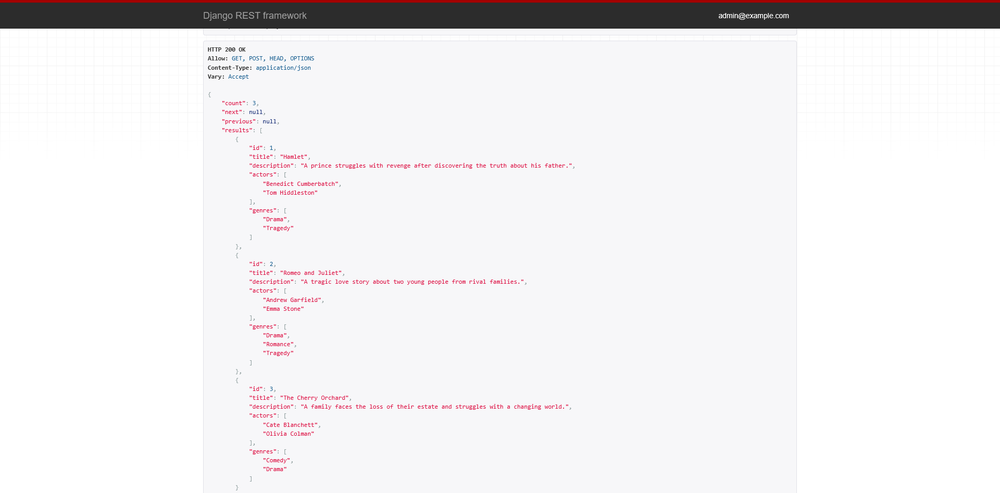
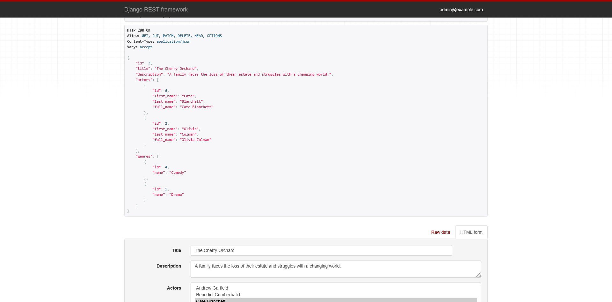
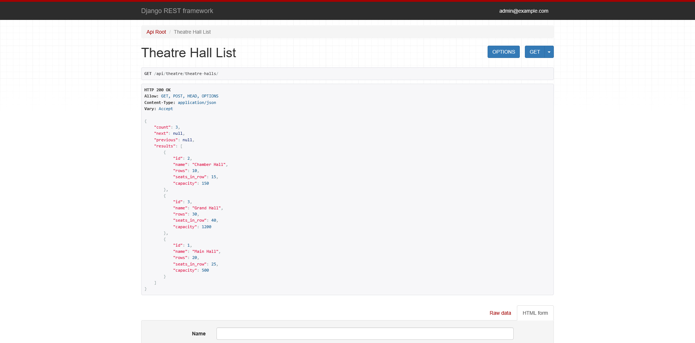
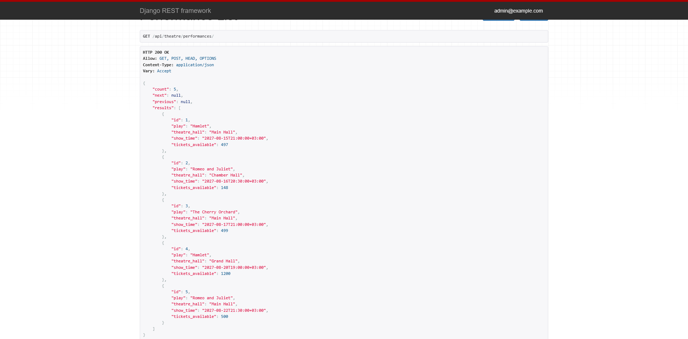
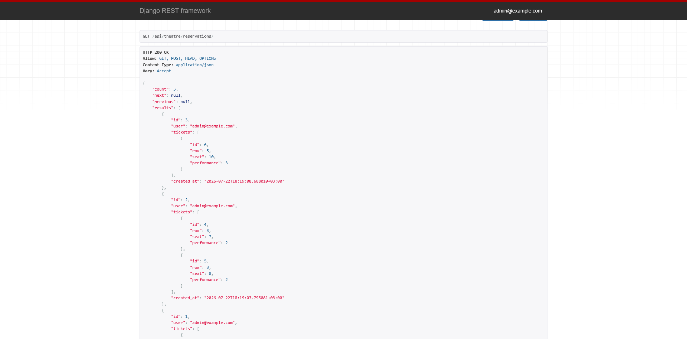

# Theatre API Service

REST API service for managing theatre data, performances, tickets, and reservations.

The API provides JWT authentication, role-based permissions, filtering, pagination, validation, and interactive OpenAPI documentation.

## Features

- JWT authentication
- Admin and regular user permissions
- Actor management
- Genre management
- Play management
- Theatre hall management
- Performance scheduling
- Ticket reservation
- Seat availability validation
- Case-insensitive uniqueness validation
- Filtering and pagination
- Swagger and ReDoc documentation
- Automated API tests

## Technologies

- Python 3.10+
- Django
- Django REST Framework
- Simple JWT
- drf-spectacular
- SQLite / PostgreSQL
- Docker
- Flake8

## Database structure



Main entities:

- `Actor`
- `Genre`
- `Play`
- `TheatreHall`
- `Performance`
- `Reservation`
- `Ticket`
- `User`

# Installation

### 1. Clone the repository

```bash
git clone https://github.com/pprykhodko/theatre-api-service
cd theatre-api-service
```

### 2. Create a virtual environment

```bash
python -m venv venv
```

Activate it on Windows:

```bash
venv\Scripts\activate
```

Activate it on Linux or macOS:

```bash
source venv/bin/activate
```

### 3. Install dependencies

```bash
pip install -r requirements.txt
```

### 4. Configure environment variables

Create a local `.env` file from the provided example.

On Windows PowerShell:

```powershell
Copy-Item .env.sample .env
```

On Linux or macOS:

```bash
cp .env.sample .env
```

Replace `THEATRE_SECRET_KEY` in `.env` with a secure secret value.

Available variables:

| Variable | Description |
|---|---|
| `THEATRE_SECRET_KEY` | Secret key used by Django |
| `THEATRE_DEBUG` | Enables or disables debug mode |
| `THEATRE_ALLOWED_HOSTS` | Comma-separated list of allowed hosts |

### 5. Apply migrations

```bash
python manage.py migrate
```

### 6. Create an administrator

```bash
python manage.py createsuperuser
```

The project uses email instead of username for authentication.

### 7. Run the development server

```bash
python manage.py runserver
```

The API will be available at:

```text
http://127.0.0.1:8000/
```

## Running with Docker

Docker Compose runs the Django application with PostgreSQL.

Create `.env` from the example file if it does not exist:

```bash
cp .env.sample .env
```

Replace the secret key and database password in `.env`, then build and
start the containers:

```bash
docker compose up --build
```

The API will be available at:

```text
http://127.0.0.1:8000/
```

Create an administrator inside the running application container:

```bash
docker compose exec app python manage.py createsuperuser
```

Stop the containers:

```bash
docker compose down
```

The PostgreSQL data is stored in the `postgres_data` Docker volume.

## Authentication

The API uses JWT authentication.

### Obtain tokens

```http
POST /api/user/token/
```

Request body:

```json
{
  "email": "admin@example.com",
  "password": "your-password"
}
```

Response:

```json
{
  "refresh": "refresh-token",
  "access": "access-token"
}
```

Send the access token in the `Authorization` header:

```text
Authorization: Bearer <access-token>
```

### Refresh access token

```http
POST /api/user/token/refresh/
```

```json
{
  "refresh": "refresh-token"
}
```

### Verify token

```http
POST /api/user/token/verify/
```

```json
{
  "token": "access-token"
}
```

## Permissions

### Unauthenticated users

Unauthenticated users cannot access theatre or reservation endpoints.

### Regular users

Regular authenticated users can:

- view actors, genres, plays, theatre halls, and performances;
- create reservations;
- view only their own reservations;
- view and update their own account.

### Administrators

Administrators can:

- create, view, update, and delete actors;
- create, view, update, and delete genres;
- create, view, update, and delete plays;
- create, view, update, and delete theatre halls;
- create, view, and delete performances;
- view all reservations;
- create new users.

A scheduled performance cannot be updated. It can only be deleted.

Some objects cannot be deleted after tickets have been sold for their performances.

## API endpoints

### Users and authentication

| Method | Endpoint | Description |
|---|---|---|
| POST | `/api/user/register/` | Create a user; administrator only |
| POST | `/api/user/token/` | Obtain access and refresh tokens |
| POST | `/api/user/token/refresh/` | Refresh an access token |
| POST | `/api/user/token/verify/` | Verify a token |
| GET | `/api/user/me/` | Retrieve the authenticated user |
| PUT | `/api/user/me/` | Update the authenticated user |
| PATCH | `/api/user/me/` | Partially update the authenticated user |

### Actors

| Method | Endpoint | Description |
|---|---|---|
| GET | `/api/theatre/actors/` | List actors |
| POST | `/api/theatre/actors/` | Create an actor |
| GET | `/api/theatre/actors/{id}/` | Retrieve an actor |
| PUT | `/api/theatre/actors/{id}/` | Update an actor |
| PATCH | `/api/theatre/actors/{id}/` | Partially update an actor |
| DELETE | `/api/theatre/actors/{id}/` | Delete an actor |

### Genres

| Method | Endpoint | Description |
|---|---|---|
| GET | `/api/theatre/genres/` | List genres |
| POST | `/api/theatre/genres/` | Create a genre |
| GET | `/api/theatre/genres/{id}/` | Retrieve a genre |
| PUT | `/api/theatre/genres/{id}/` | Update a genre |
| PATCH | `/api/theatre/genres/{id}/` | Partially update a genre |
| DELETE | `/api/theatre/genres/{id}/` | Delete a genre |

### Plays

| Method | Endpoint | Description |
|---|---|---|
| GET | `/api/theatre/plays/` | List plays |
| POST | `/api/theatre/plays/` | Create a play |
| GET | `/api/theatre/plays/{id}/` | Retrieve a play |
| PUT | `/api/theatre/plays/{id}/` | Update a play |
| PATCH | `/api/theatre/plays/{id}/` | Partially update a play |
| DELETE | `/api/theatre/plays/{id}/` | Delete a play |

### Theatre halls

| Method | Endpoint | Description |
|---|---|---|
| GET | `/api/theatre/theatre-halls/` | List theatre halls |
| POST | `/api/theatre/theatre-halls/` | Create a theatre hall |
| GET | `/api/theatre/theatre-halls/{id}/` | Retrieve a theatre hall |
| PUT | `/api/theatre/theatre-halls/{id}/` | Update a theatre hall |
| PATCH | `/api/theatre/theatre-halls/{id}/` | Partially update a theatre hall |
| DELETE | `/api/theatre/theatre-halls/{id}/` | Delete a theatre hall |

The number of rows and seats in a row cannot be changed after a hall has been created.

### Performances

| Method | Endpoint | Description |
|---|---|---|
| GET | `/api/theatre/performances/` | List performances |
| POST | `/api/theatre/performances/` | Create a performance |
| GET | `/api/theatre/performances/{id}/` | Retrieve a performance |
| DELETE | `/api/theatre/performances/{id}/` | Delete a performance |

Performances cannot be updated after creation.

### Reservations

| Method | Endpoint | Description |
|---|---|---|
| GET | `/api/theatre/reservations/` | List available reservations |
| POST | `/api/theatre/reservations/` | Create a reservation |
| GET | `/api/theatre/reservations/{id}/` | Retrieve a reservation |

Regular users can only access their own reservations. Administrators can view all reservations.

Tickets are created as part of a reservation and do not have a separate API endpoint.

## Creating a reservation

Example request:

```http
POST /api/theatre/reservations/
```

```json
{
  "tickets": [
    {
      "row": 1,
      "seat": 1,
      "performance": 3
    },
    {
      "row": 1,
      "seat": 2,
      "performance": 3
    }
  ]
}
```

The authenticated user is assigned to the reservation automatically.

The API validates that:

- the performance is scheduled for the future;
- the row exists in the selected theatre hall;
- the seat exists in the selected row;
- the seat has not already been reserved;
- the same seat is not included twice in one request.

## Demo

### Actor





### Genre






### Play





### Theatre Hall



### Performance



### Reservation


